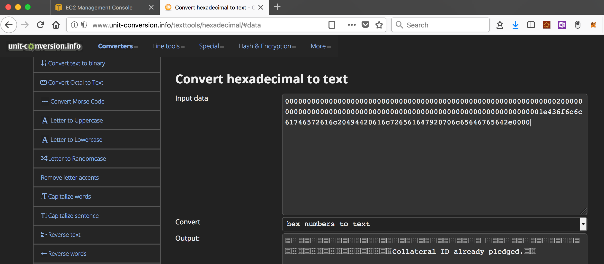

# Introduction

This document will walk through the steps required to deploy and interact with the Smart Contract.

1. Deployment of contract.
2. Create a new consortium.
3. Create a new loan with the consortium (created in 2) with a collateral.
4. Create a new loan with the consortium (created in 2) with same collateral as used in 3.

## Pre-requisites

1. Install [Microsoft VS Code](https://code.visualstudio.com/)
2. Install [Solidity extension](https://marketplace.visualstudio.com/items?itemName=JuanBlanco.solidity)
3. Clone this repository `git clone https://github.com/chainhead/poc.git` and open in VS Code.

## Demo

1. From the repository, open the contract at `sol/loansyndev.sol`.
2. Compile this contract with _Press F1 Solidity : Compile Current Solidity Contract), or F5_
3. Three files will be created in the `bin` folder named as `loansyndev.bin`, `loansyndev.abi` and `loansyndev.json`.

### Contract deployment

1. Open `js/deploy-contract.js` and change the value of `ethereumHttpEndpoint` to the public IP address of `Node2`. Note that, `Node2` is chosen because the `rpcaddr` parameter was set to `0.0.0.0` to accept connections from every where.
2. Set `accountAddr` to the address that was created when this node was set-up.
3. Set `pwd` to the value as saved in `poc/password.txt`.
4. On command line, navigate to the `js` folder and run this command `node deploy-contract.js`.

The following shows the address on the blockchain where the contract was deployed.

```bash
Nageshs-MacBook-Pro:js nsubrahm$ node deploy-contract.js 
Transaction hash : 0x8e9afed6865d5392f571cd021a5f5277ac3c8a9558815c295374b62439a0df84
Contract address : undefined
Account unlocked
Transaction hash : 0x8e9afed6865d5392f571cd021a5f5277ac3c8a9558815c295374b62439a0df84
Contract address : 0xadd36c62a8fe6f81f53ac8dccbfa1d659d709117
```

### New consortium

1. Open `js/new-consortium.js` and change the value of `ethereumHttpEndpoint` to the public IP address of `Node2`. Note that, `Node2` is chosen because the `rpcaddr` parameter was set to `0.0.0.0` to accept connections from every where.
2. Change `contractAddress` to point to the address returned upon deployment of contract i.e. `0xadd36c62a8fe6f81f53ac8dccbfa1d659d709117`.
3. Set `pwd` to the value as saved in `poc/password.txt`.
4. On command line, navigate to the `js` folder and run this command `node new-consortium.js`.
5. The command returns the transaction hash for adding a new consortium.

### New loan

1. Open `js/new-loan.js` and change the value of `ethereumHttpEndpoint` to the public IP address of `Node2`. Note that, `Node2` is chosen because the `rpcaddr` parameter was set to `0.0.0.0` to accept connections from every where.
2. Change `contractAddress` to point to the address returned upon deployment of contract i.e. `0xadd36c62a8fe6f81f53ac8dccbfa1d659d709117`.
3. Set `pwd` to the value as saved in `poc/password.txt`.
4. On command line, navigate to the `js` folder and run this command `node new-loan.js`.
5. The command returns the transaction hash for adding a new consortium.

### New loan - same collateral

1. Open `js/new-loan.js` and change the value of `ethereumHttpEndpoint` to the public IP address of `Node2`. Note that, `Node2` is chosen because the `rpcaddr` parameter was set to `0.0.0.0` to accept connections from every where.
2. Change `contractAddress` to point to the address returned upon deployment of contract i.e. `0xadd36c62a8fe6f81f53ac8dccbfa1d659d709117`.
3. Set `pwd` to the value as saved in `poc/password.txt`.
4. Change `loanId` and `customerId` but keep the `collateralId` same.
5. Ensure that the `consortiumId` is same as the one used for creating the new consortium.
6. On command line, navigate to the `js` folder and run this command `node new-loan.js`.
7. The command returns the transaction hash for adding a new consortium.

To determine the success of transaction, run the following command in a separate terminal for `Node2` to launch the console.

```bash
geth --datadir poc attach
```

From the console, look for transaction receipt using the transaction hash obtained above.

```bash
> eth.getTransactionReceipt('0x9b2a39e2fc45adc1339838f3ca2cb69c5af0e22d71c890ce9ca52e5b285ac468')
{
  blockHash: "0x434579ff25f1441000e072920c8f9a7053dc382ff5336e7aa9d990bfe658581c",
  blockNumber: 4349,
  contractAddress: null,
  cumulativeGasUsed: 25458,
  from: "0xb16ee696fcc86065fdc05a36da77d67fca2df1b2",
  gasUsed: 25458,
  logs: [{
      address: "0xadd36c62a8fe6f81f53ac8dccbfa1d659d709117",
      blockHash: "0x434579ff25f1441000e072920c8f9a7053dc382ff5336e7aa9d990bfe658581c",
      blockNumber: 4349,
      data: "0x0000000000000000000000000000000000000000000000000000000000000020000000000000000000000000000000000000000000000000000000000000001e436f6c6c61746572616c20494420616c726561647920706c65646765642e0000",
      logIndex: 0,
      removed: false,
      topics: ["0x2844c95bf1b4598da931d527f903501abc60fe0199c65da52d5ce818c6c5e961"],
      transactionHash: "0x9b2a39e2fc45adc1339838f3ca2cb69c5af0e22d71c890ce9ca52e5b285ac468",
      transactionIndex: 0
  }],
  logsBloom: "0x00000000000000000000000000000000000000000000000000000000000000000000000000000100000000000000000000000000000000000000000000000000000200000000000000000000000000000000000000000010000000000000000000000000000000000000000000000000000000000000000000000000000000000000000000000000000000000000000000000000080000000000000000000000000000000000000000000000000000000000000000000000000000000000000040000000000000000000020000000000000000000000000000000000000000000000000000000000000000000000000000000000000000000000000000000000",
  status: "0x1",
  to: "0xadd36c62a8fe6f81f53ac8dccbfa1d659d709117",
  transactionHash: "0x9b2a39e2fc45adc1339838f3ca2cb69c5af0e22d71c890ce9ca52e5b285ac468",
  transactionIndex: 0
}
```

Note the value of `data` in the `logs` field. This value is set to the event message as set in the Solidity contract. Copy the value and use a hex to text converter to for human readable output as shown here. 