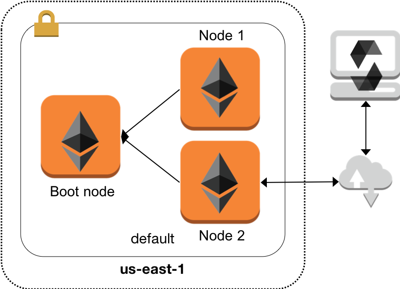

# Introduction

This document describes the steps required to set-up the AWS infra-structure to run the **Loan Syndication** contract on AWS. This document assumes an active AWS account and familiarity with launching AWS EC2 instances. By the end of this document, there will be three AWS EC2 instances that form an Ethereum private network.

- [Introduction](#introduction)
    - [Topology](#topology)
    - [Infra-structure set-up](#infra-structure-set-up)
    - [Installing Ethereum client](#installing-ethereum-client)
    - [Set-up a private network](#set-up-a-private-network)
        - [Create accounts](#create-accounts)
        - [Boot-node](#boot-node)
        - [Set-up nodes of private network](#set-up-nodes-of-private-network)
            - [Generate `genesis.json` document](#generate-genesisjson-document)
            - [Node initialisation](#node-initialisation)
            - [Start nodes](#start-nodes)
        - [Verification](#verification)

## Topology

The AWS infra-structure will address the topology as shown in the image below. In this topology,

- Three EC2 instances are spun up in the default VPC of a region.
- One of the instances serves as a boot node for other instances to look-up.
- Other two instances serve as Ethereum nodes of the network.
- One of the Ethereum node will be connected to a laptop from where the contract will be deployed and used.



## Infra-structure set-up

The infra-structure is set-up of Ubuntu-16.04 Linux instance. The overall installation procedure is categorised into two sections:

1. Installing of Ethereum client
2. Set-up a private network

Before going ahead, three EC2 instances need to be spun up that are running Ubuntu-16.04.

> It is recommended to use Elastic IP for the instances so that the commands need not be edited again in case of a restart.

For the rest of the document the following naming will be used.

| Name | Role |
| ---- | ---- |
| Node0 | Boot node |
| Node1 | Node 1 of the network |
| Node2 | Node 2 of the network |

## Installing Ethereum client

To install Ethereum client, first create a directory named `poc` where private network data would be saved. Then, install client as shown below.

```bash
mkdir poc
sudo apt-get install software-properties-common
sudo add-apt-repository -y ppa:ethereum/ethereum
sudo apt-get update
sudo apt-get install ethereum
```

For more information, see [Installation Instructions for Ubuntu](https://github.com/ethereum/go-ethereum/wiki/Installation-Instructions-for-Ubuntu).

To test the installation, simply type `geth` on command line and hit enter. This will make this machine connect to the main Ethereum network with messages as shown below.

```bash
ubuntu@ip-172-31-63-254:~$ geth
WARN [08-23|16:47:56.695] Sanitizing cache to Go's GC limits       provided=1024 updated=330
INFO [08-23|16:47:56.699] Maximum peer count                       ETH=25 LES=0 total=25
INFO [08-23|16:47:56.704] Starting peer-to-peer node               instance=Geth/v1.8.13-stable-225171a4/linux-amd64/go1.10
INFO [08-23|16:47:56.704] Allocated cache and file handles         database=/home/ubuntu/.ethereum/geth/chaindata cache=247 handles=512
INFO [08-23|16:47:56.739] Writing default main-net genesis block 
INFO [08-23|16:47:57.162] Persisted trie from memory database      nodes=12356 size=1.88mB time=79.143309ms gcnodes=0 gcsize=0.00B gctime=0s livenodes=1 livesize=0.00B
INFO [08-23|16:47:57.163] Initialised chain configuration          config="{ChainID: 1 Homestead: 1150000 DAO: 1920000 DAOSupport: true EIP150: 2463000 EIP155: 2675000 EIP158: 2675000 Byzantium: 4370000 Constantinople: <nil> Engine: ethash}"
INFO [08-23|16:47:57.163] Disk storage enabled for ethash caches   dir=/home/ubuntu/.ethereum/geth/ethash count=3
INFO [08-23|16:47:57.163] Disk storage enabled for ethash DAGs     dir=/home/ubuntu/.ethash               count=2
INFO [08-23|16:47:57.163] Initialising Ethereum protocol           versions="[63 62]" network=1
INFO [08-23|16:47:57.163] Loaded most recent local header          number=0 hash=d4e567…cb8fa3 td=17179869184
INFO [08-23|16:47:57.163] Loaded most recent local full block      number=0 hash=d4e567…cb8fa3 td=17179869184
INFO [08-23|16:47:57.163] Loaded most recent local fast block      number=0 hash=d4e567…cb8fa3 td=17179869184
INFO [08-23|16:47:57.164] Regenerated local transaction journal    transactions=0 accounts=0
INFO [08-23|16:47:57.168] Starting P2P networking 
INFO [08-23|16:47:59.280] UDP listener up                          self=enode://f880d324ed8336751712715f6f6ac215b46f353cea00258221b3b2d4e5e47107c39ed84385395eb06b2c6889fe75768805115f8f9f1e55287af82b86d65e4553@[::]:30303
INFO [08-23|16:47:59.285] IPC endpoint opened                      url=/home/ubuntu/.ethereum/geth.ipc
INFO [08-23|16:47:59.287] RLPx listener up                         self=enode://f880d324ed8336751712715f6f6ac215b46f353cea00258221b3b2d4e5e47107c39ed84385395eb06b2c6889fe75768805115f8f9f1e55287af82b86d65e4553@[::]:30303
```

**Note** the value of `ChainID: 1` which indicates the main Ethereum network.

## Set-up a private network

To set-up a private network, the following steps will be followed:

1. Create accounts on both nodes.
2. Set-up boot node.
3. Set-up nodes of private network.

### Create accounts

On both `Node1` and `Node2`, run the following commands. Enter a strong and easy to remember password when prompted. The second command saves password into a file that can be used in later commands.

```bash
geth --datadir poc account new
echo 'your_password' > poc/password.txt
```

Copy the value resulting of `Address` into a file that can be located easily later.

### Boot-node

The `Node0` machine will be set-up as a boot node. A boot node is a machine on the Ethereum network that is looked up clients for node discovery. See [more](https://github.com/ethereum/go-ethereum/wiki/Connecting-to-the-network). To set-up the boot node, run the commands as shown below. Note that, `bootnode` command was installed upon installation of Ethereum client.

```bash
bootnode -genkey boot.key
bootnode -nodekey boot.key -verbosity 9
```

The first command creates a key - `boot.key` - that is used in the next command to start-up the boot node. In the result of the second command, the `enode` of this node will be displayed. Copy its value till - not including - the `@` sign. This value will be used in other nodes of the network for look-up. For example, see below.

```bash
ubuntu@ip-172-31-63-254:~/poc$ bootnode -nodekey boot.key -verbosity 9
INFO [08-23|17:02:42.438] UDP listener up                          self=enode://86a17748a5ea863e7b771bcc9245aba5383093892cfad680e90cdc8ceeefb97155f2c6616173d90e686b0379061a63c5e8af810adf6899756e4b25d52f0117a3@[::]:30301
```

The `enode` value to be used is `86a17748a5ea863e7b771bcc9245aba5383093892cfad680e90cdc8ceeefb97155f2c6616173d90e686b0379061a63c5e8af810adf6899756e4b25d52f0117a3`.

### Set-up nodes of private network

To set-up the private network, the following steps will be followed.

1. Generate a `genesis.json` document on `Node1`.
2. Copy `genesis.json` to `Node2`.
3. Start `Node1` and `Node2`.

#### Generate `genesis.json` document

As a part of installation of Ethereum client, the `puppeth` command is installed. The `puppeth` command guides, amongst others, the generation of the genesis document.

1. Type `puppeth` on command line and hit enter.
2. Enter network name as `poc`.
3. Enter `2` _Configure new genesis_ option.
4. Enter `2` _Clique - Proof of Authority_ option.
5. Enter `10` as number of seconds for mining a new block.
6. Enter the addresses created on both machines one after another.
7. Enter the addresses created on both machines one after another.
8. Enter `2525` as the network ID.
9. Enter `2` _Manage existing genesis_
10. Enter `2` _Export genesis configuration_
11. Enter name as `genesis.json`
12. `Ctrl-C` to exit.

#### Node initialisation

Before the nodes could be started, an intialisation needs to be done with the `genesis.json` created in previous step. For this, copy the `genesis.json` into home folder on `Node1` and `Node2` using say, `scp`. Once copied, run the following command on both machines.

```bash
geth --datadir poc init genesis.json
```

#### Start nodes

Run this command on `Node1`.

```bash
geth --datadir poc --networkid 2525 --port 30310 --bootnodes enode://86a17748a5ea863e7b771bcc9245aba5383093892cfad680e90cdc8ceeefb97155f2c6616173d90e686b0379061a63c5e8af810adf6899756e4b25d52f0117a3@35.xxx.xxx.xxxx:30301 --syncmode full --rpc --rpcaddr 'localhost' --rpccorsdomain '*' --rpcvhosts '*' --rpcapi 'eth,web3,db,personal,txpool,miner' --gasprice '1' --unlock 0xddacf9cd4cf475e63402d07b0ca4dd6ae018a499 --password poc/password.txt --mine
```

Notes:

1. `datadir` points to the folder that was created, for this private network, at the begining.
2. `networkid` is set to the value when running the `puppeth` command.
3. `port` uses the default value for discovery.
4. `bootnodes` tells `geth` to use a boot node for discovery. Its value is set to the value of `enode` as displayed in the output of `bootnode` command on `Node0` followed by the `@` symbol and the public IP address of `Node0` mention. The port number of `30301` is default.
5. `syncmode` syncs the block headers, the block bodies, and validates every element from genesis block.
6. `rpc` exposes the RPC feature of this node on `8545` port number.
7. `rpcaddr` binds RPC to `localhost`; so, connections from other machines would not happen.
8. `rpccorsdoman` and `rpcvhosts` allow connections from client and server side. (_Not entirely applicable to this PoC_)
9. `rpcapi` lists the various API exposed via RPC by this machine.
10. `gasprice` set to minimal acceptable value.
11. `unlock` and `password` allow the use of the account (as set previously) to be credited with Ethers.

Run this command on `Node2`.

```bash
geth --datadir poc --networkid 2525 --port 30310 --bootnodes enode://86a17748a5ea863e7b771bcc9245aba5383093892cfad680e90cdc8ceeefb97155f2c6616173d90e686b0379061a63c5e8af810adf6899756e4b25d52f0117a3@35.xxx.xxx.xxxx:30301 --syncmode full --rpc --rpcaddr '0.0.0.0' --rpccorsdomain '*' --rpcvhosts '*' --rpcapi 'eth,web3,db,personal,txpool,miner' --gasprice '1' --unlock 0xb16ee696fcc86065fdc05a36da77d67fca2df1b2 --password poc/password.txt --mine
```

Notes:

1. All notes for `Node1` apply here.
2. The `rpcaddr` parameter is set to `0.0.0.0` to allow connections from anywhere. This is *discouraged* in production scenarios.

### Verification

With the boot node and other nodes running, the following should be seen.

1. Messages on the boot node on connections from both machines
2. Messages on both nodes on successful mining of blocks
