# Quick start

This chapter describes the deployment of Smart Contract and testing of the same for new consortium, new loan and new loan with same collateral.

- [Quick start](#quick-start)
  - [Smart Contract demo](#smart-contract-demo)
    - [Deploy contract](#deploy-contract)
    - [Gas calculation](#gas-calculation)
    - [Test contract - new consortium](#test-contract---new-consortium)
    - [Test contract - consortium members](#test-contract---consortium-members)
    - [Test contract - consortium leader](#test-contract---consortium-leader)
    - [Test contract - new loan](#test-contract---new-loan)
    - [Test contract - new loan, same collateral](#test-contract---new-loan-same-collateral)

## Smart Contract demo

### Deploy contract

For the Smart Contract demo, follow the steps below.

1. Launch https://remix.ethereum.org in a browser.
2. Remove the default `.sol` contract that appears.  
  2.1 On the left hand navigation pane, expand the button for browser.  
  2.2 Delete files appearing there. See 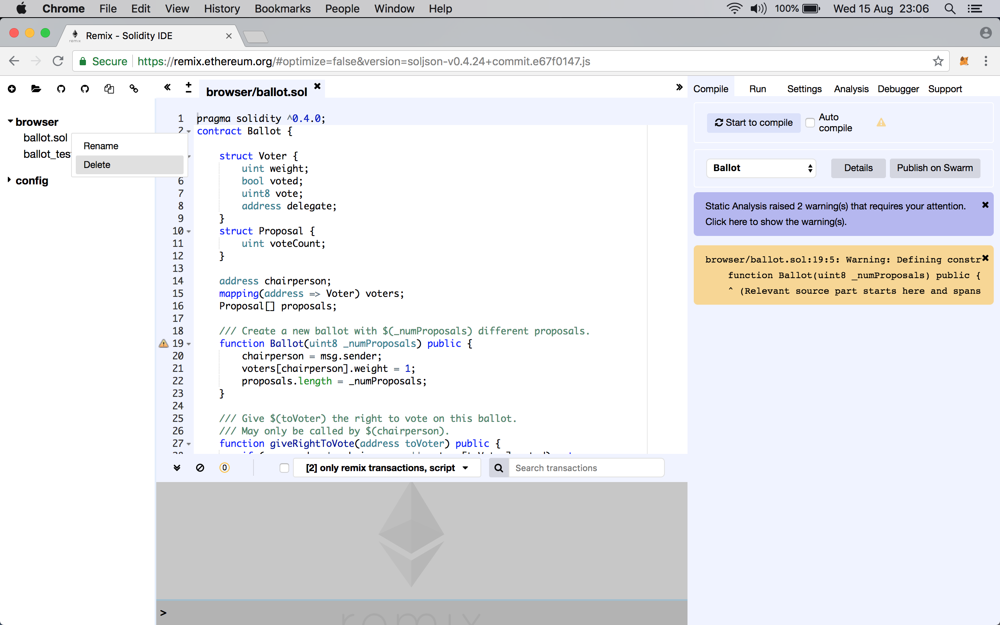
3. Click the plus icon on the top of left hand navigation pane.
4. Enter file name as `loansynd.sol` and click OK. 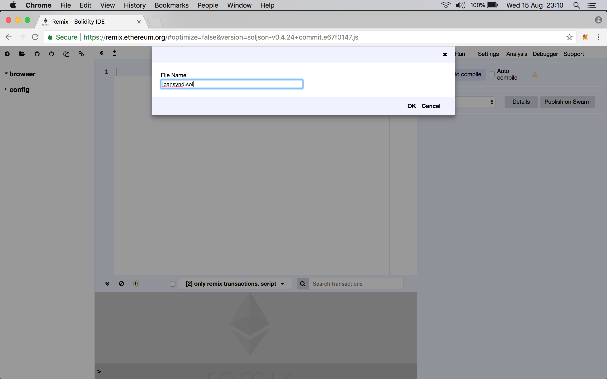
5. Copy all the contents of `loandsynd.sol` from this project into the editor. 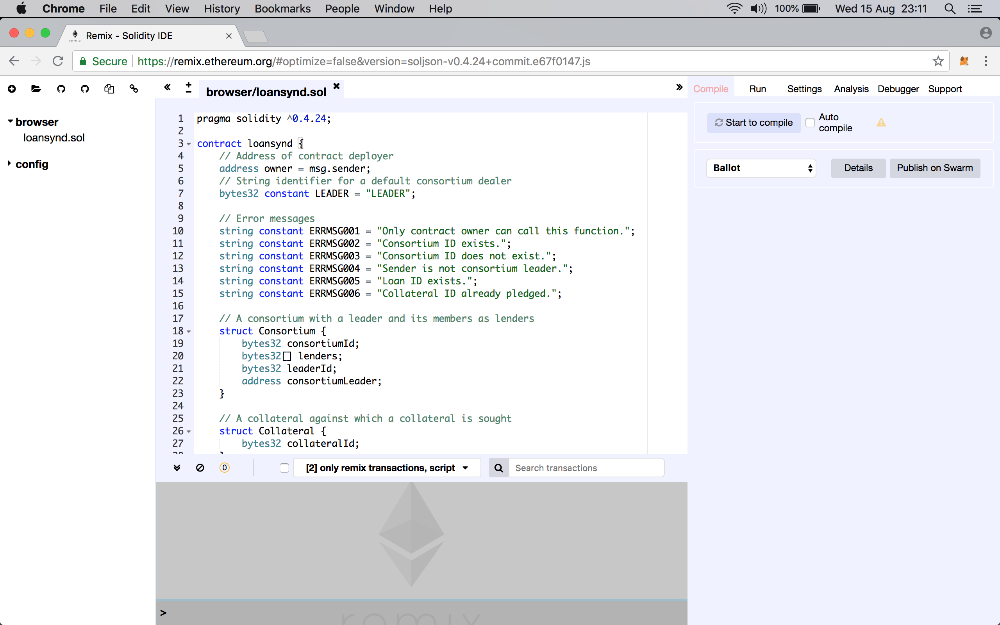
6. Click on **Start to Compile**. (See ). You may see some compilation warnings; they are OK to ignore for this demo.
7. Click on **Run** tab. Ensure that the **Environment** is set to **Javascript VM**. This option helps in quickly testing the contract without focussing on the underlying infra-structure. 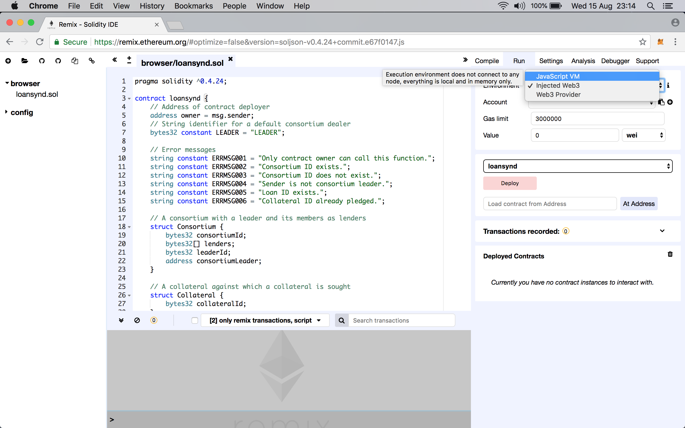
8. Click on **Deploy** button to deploy this contract. 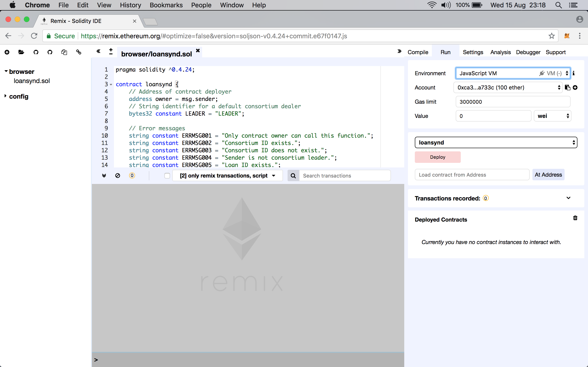
9. The results of deployment can be seen in screen-shot below. 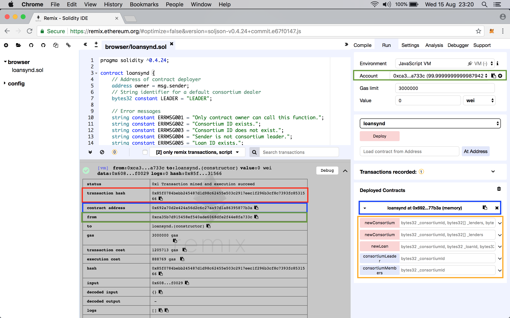   
  9.1 Since the deployment of the contract is itself a transaction that changes the _world state_ of Ethereum, it has a corresponding a transaction hash as shown in the red box.  
  9.2 Since this transaction is a deployment of a contract, the Remix IDE shows the address where this contract was deployed. This is highlighted in the blue box. Note the trailing two hex digits; they are the same as shown in the blue box on the right hand side navigation pane.  
  9.3 The functions of this contract are shown immediately below it as marked in the orange box.  
  9.4 The same contract and its functions can be displayed by copy-pasting the contract address (see 9.2) into the text field left of **At Address** button and clicking the same.  
  9.5 The address used to deploy this contract is marked in the green boxes. This address is automatically generated and credited with 100 ETH by the Javascript VM for sake of convenience.

### Gas calculation

In the results of deployment, the following can be seen:

1. Gas sent is `3000000`.
2. The transaction cost - as reported in Remix IDE - is `1205713`.
3. The execution cost is `888769`.
4. The transaction cost - as reported in Remix IDE - is inclusive of the execution cost. Therefore, the _actual_ transaction cost is the difference of 2 and 3 above; or, `316944`.

This section explores the figures as reported above.

1. The gas sent is simply the figure that appears immediately below the **Account** field in the right hand side navigation pane.
2. The Appendix for fee schedule in the [Ethereum Yellow Paper](https://ethereum.github.io/yellowpaper/paper.pdf) mentions `200` gas for every byte for `Gcodedeposit` operation. This operation is used for contract creation.
3. On the **Compile** tab, click on **Details** button to see the result of compilation. Scroll down all the way to **Runtime bytecode**. Refer 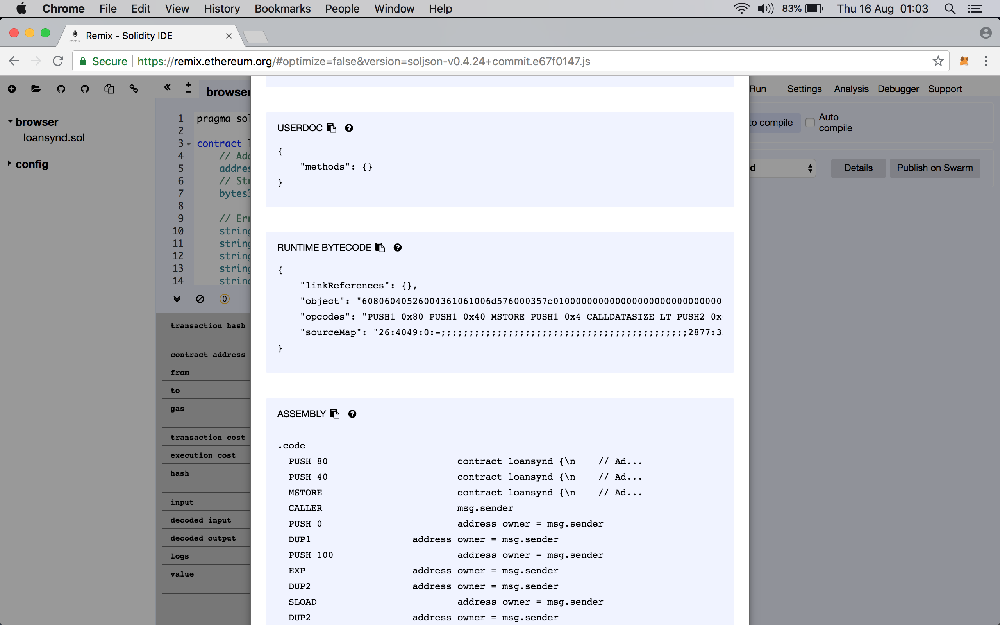.
4. Click on the icon to copy the displayed JSON and paste into a plain text file. From that file, copy the value of the `object` field and paste into yet another plain text file and save it. Check the number of bytes reported and divide by two for the number of bytes in contract creation. It should be `4338`.
5. Multiply the byte count with gas price for contract creation: `4338 * 200 = 867600` to return code deposit cost.
6. In the compilation output details page, there is a section for **Assembly** that shows the operation codes correspoding to this Solidity code. This [handy spreadsheet](https://docs.google.com/spreadsheets/d/1n6mRqkBz3iWcOlRem_mO09GtSKEKrAsfO7Frgx18pNU/edit#gid=0) can be used for calculating the execution cost.
7. A simpler way is to look at the **GASESTIMATES** section in the compiler output (see 3 to locate this output) as shown in the 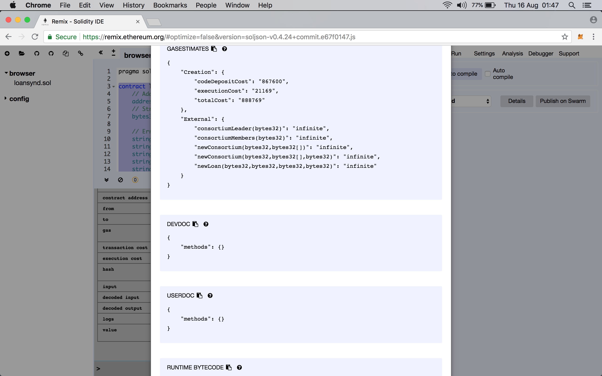. In that section, we see the value of `executionCost` as `21169`. Adding to this the code deposit cost (see 5) of `867600`, the total execution cost of `888769` is arrived at.
8. Further, the following prices also apply:  
  8.1. A fee of `32000` for `Gtxcreate` which is a contract creating transaction.  
  8.2. A fee of `4` for `Gtxdatazero` for every zero byte of data or code for a transaction.  
  8.3. A fee of `68` for `Gtxdatanonzero` for every non-zero byte of data or code for a transaction.  
  8.4. A fee of `21000` for `Gtransaction` for every transaction.
9. It is tedious to count the number of zero and non-zero bytes in the runtime byte code of `4338` bytes (see 4). Nevertheless, some back calculation can probably help verify.  
  9.1. If `x` is number of zero bytes and `y` the number of non-zero bytes, then `x + y = 4338` and `4x + 68y = 316944 - 32000 - 21000`.  
  9.2 Solving these equations, `x=485` and `y=3853` - reasonable.
10. Finally, post contract deployment, the balance of the address is the difference between `100` ETH (initial) and total transaction cost `1205713 wei`.

### Test contract - new consortium

A new consortium of banks is recorded on the blockchain. In loan syndication, there is a lead banker within a consortium. This Smart Contract provides two options for defining the leader of a consortium. First, the leader is automatically set to the contract deployer _if_ the address creating the consortium is same as that of deployer. Second, the leader maybe manually provided. For sake of simplicity, this document uses the first option.

> The input type is set to `bytes32` so that all entries are prefixed with a `0x` and padded with zeroes for 32 bytes.

1. Refer screen-shot 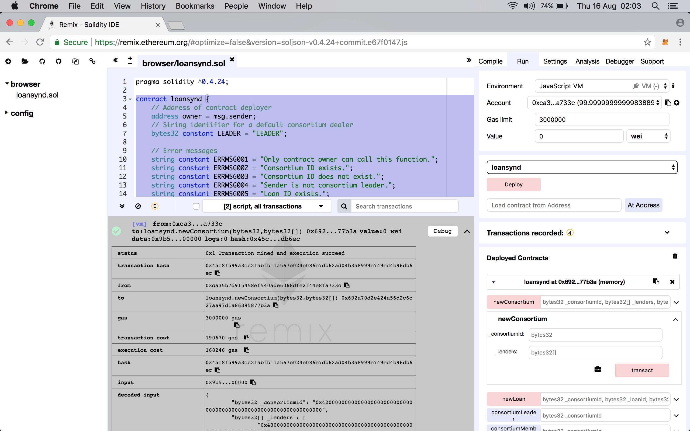
2. Click on down arrow against the function `newConsortium` whose signature has two arguments only.
3. The consortium ID is defined simply as `B` which is `0x4200000000000000000000000000000000000000000000000000000000000000` in `bytes32`.
4. Since the `lenders` argument is an array of `bytes32`, the value is input as `["0x00...0000","0x00...0001"]`. Three lenders are considered to be part of this consortium and are simply defined as `C`, `D` and `E`. Therefore, this field is defined as `["0x4300000000000000000000000000000000000000000000000000000000000000","0x4400000000000000000000000000000000000000000000000000000000000000","0x4500000000000000000000000000000000000000000000000000000000000000"]`.
5. Note that, this function will assign the leader of consortium as the address that deployed this contract. So, in all, four lenders will be part of the consortium.
6. Click on **Transact**.

### Test contract - consortium members

1. Refer 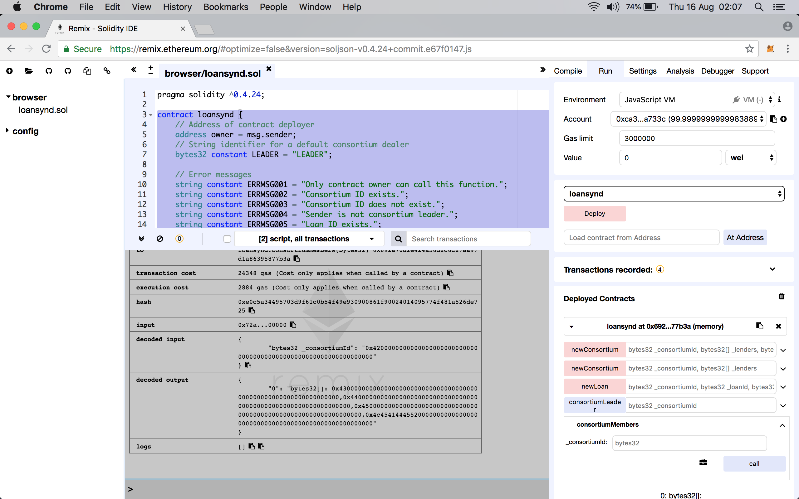
2. Enter consortium ID as `0x4200000000000000000000000000000000000000000000000000000000000000` for the function `consortiumMembers` and click on **Call**.
3. The result is seen in the blue box in the output area.
4. The decoded output shows a `bytes32` array of all the lenders that are part of this consortium.
5. Further, note the dark green color box. It shows the leader of this consortium - `0x4c4541444552` is ASCII for `LEADER` as mentioned in the contract.

### Test contract - consortium leader

1. Refer 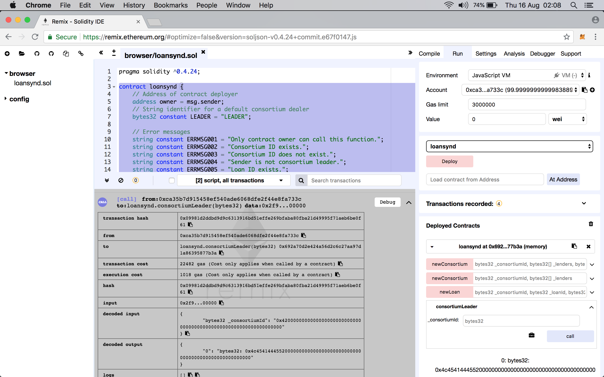
2. Enter consortium ID as `0x4200000000000000000000000000000000000000000000000000000000000000` for the function `consortiumMembers` and click on **Call**.
3. The result is seen in the dark green box in the output area.
4. The decoded output shows a `bytes32` string for the consortium leader - `0x4c4541444552` is ASCII for `LEADER` as mentioned in the contract.
5. Notice how it matches with the output as seen in previous section.

### Test contract - new loan

1. Refer 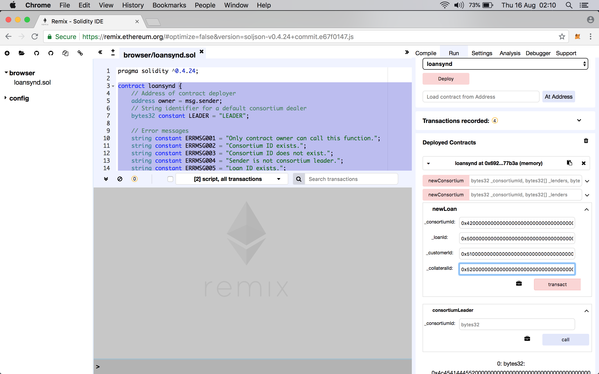
2. To apply for a new loan against a collateral, enter arguments for the function `newLoan` as follows. Refer blue color box in the image.
  2.1. Enter consortium ID as `0x4200000000000000000000000000000000000000000000000000000000000000`.
  2.2. Enter loan ID as letter `P` or `0x5000000000000000000000000000000000000000000000000000000000000000` as a `bytes32` string.
  2.3. Enter customer ID as letter `Q` or `0x5100000000000000000000000000000000000000000000000000000000000000` as a `bytes32` string.
  2.4. Enter collateral ID as letter `R` or `0x5200000000000000000000000000000000000000000000000000000000000000` as a `bytes32` string.
3. Click on **Transact** to initiate the contract execution. The result of execution is not shown in the screen-shot.

### Test contract - new loan, same collateral

1. Refer 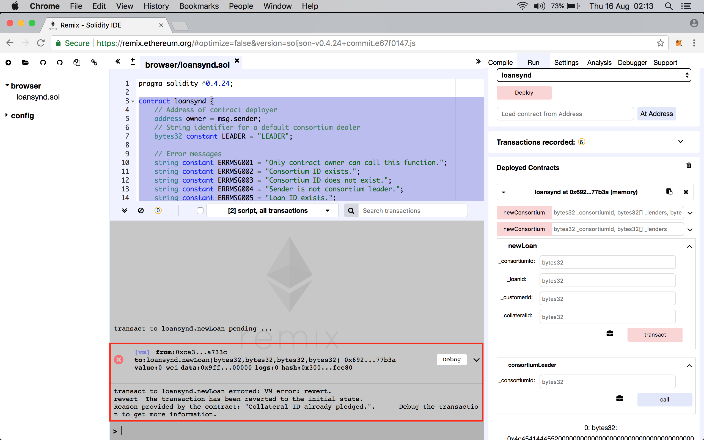
2. To apply for yet another loan, we follow same steps as above except:
  2.1. Enter a new loan ID as letter `S` or `0x5300000000000000000000000000000000000000000000000000000000000000` as a `bytes32` string.
  2.2. Enter collateral ID same as earlier i.e. `R` or `0x5200000000000000000000000000000000000000000000000000000000000000` as a `bytes32` string.
3. Click on **Transact** to initiate the contract execution.
4. As shown in the red box, we see that the contract execution failed with a message as `Collateral ID already pledged`.

It is worth noting that, at the end of previous step all participants in the network would have a copy of the ledger that would store the mapping of collateral and loans. While the ledger does not _easily_ lend itself for investigation, a participant can also query its local copy to know if a collateral ID is part of a loan, etc.
